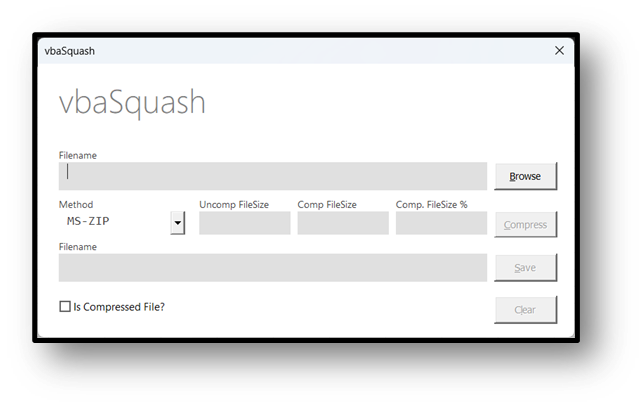

# vbaSquash

[](https://github.com/sancarn/awesome-vba)


## Compression routines for VBA

`vbaSquash` is a single VBA class that uses Windows' own compression engines in `cabinet.dll` and `ntdll.dll`. 

### Features

*   **Simple interface:** `CompressBytes`, `DecompressBytes`, `CompressFile`, `DecompressFile` and `IsCompressed`.
*   **No additional software:** uses the compression routines built into Windows.
*   **Seven algorithms:** four from the Compression API in `cabinet.dll`, and three from `RtlCompressBuffer` in `ntdll.dll`.
*   **Automatic algorithm detection:** data compressed by `vbaSquash` carries a small header, so `DecompressBytes` and `DecompressFile` work out the algorithm (and, for the ntdll algorithms, the original size) by themselves.

### Getting started

Import `src/vbaSquash.cls`:

```vba
Dim Squash As vbaSquash
Set Squash = New vbaSquash
```

Or 

```vba
Dim inputData() As Byte
Dim compressedData() As Byte

inputData = StrConv("Squishy squashy!", vbFromUnicode)

With New vbaSquash
    compressedData = .CompressBytes(inputData, XPRESS)
End With
```

If you do not specify an algorithm, `CompressBytes` and `CompressFile` use `LZMS`.

### Demo utility

The repo includes a small utility that demonstrates the class. Pick a file and it detects whether the file is already compressed, then offers to compress or decompress it.



### Usage

#### Compress a file
```vba
Dim Squash As New vbaSquash
Dim success As Boolean

success = Squash.CompressFile("C:\YourDocFolder\input.txt", "C:\YourDocFolder\input.txt.compressed", LZMS)
' Saved as C:\YourDocFolder\input.txt.compressed
```

#### Decompress a file
```vba
Dim Squash As New vbaSquash
Dim success As Boolean

' The algorithm is detected from the file, so it does not need to be specified.
success = Squash.DecompressFile("C:\YourDocFolder\input.txt.compressed", "C:\YourDocFolder\NewFile.txt")
' Saved as C:\YourDocFolder\NewFile.txt
```

Always pass an output file name. If you leave it out, the output defaults to the input file itself, so the call returns `False` (or, with `Overwrite:=True`, replaces your original).

Both file methods refuse to overwrite an existing file unless you pass `Overwrite:=True`, and both return `False` if anything goes wrong.

#### Compress a byte array
```vba
Dim Squash As New vbaSquash
Dim inputData() As Byte
Dim compressedData() As Byte

inputData = Squash.ReadFile("C:\file.dat")
compressedData = Squash.CompressBytes(inputData, XPRESS)
```

#### Decompress a byte array
```vba
Dim Squash As New vbaSquash
Dim decompressedData() As Byte

decompressedData = Squash.DecompressBytes(compressedData)
```

#### Check whether data is compressed
```vba
Dim algo As COMPRESS_ALGORITHM_ENUM
algo = Squash.IsCompressed("C:\file.dat")   ' a file path or a byte array
If algo = 0 Then Debug.Print "Not compressed by vbaSquash"
```

A failed call returns an empty array (or `False` for the file methods) rather than raising an error. `Squash.CheckArray(result)` returns the number of bytes, or 0 if the array is empty.

### Supported algorithms

| Enum | Value | Library | Notes |
|---|---|---|---|
| `MSZIP` | 2 | cabinet.dll | The CAB-file format. Legacy. |
| `XPRESS` | 3 | cabinet.dll | Fast, medium ratio. A good all-rounder. |
| `XPRESS_HUFF` | 4 | cabinet.dll | XPRESS with Huffman coding. |
| `LZMS` | 5 | cabinet.dll | Highest ratio, slowest to compress. The default. |
| `RTL_LZNT1` | 12 | ntdll.dll | The format NTFS uses for compressed files. |
| `RTL_XPRESS` | 13 | ntdll.dll | Fast. Rejects very small inputs (under about 10 bytes). But then, why are you compressing such small data? |
| `RTL_XPRESS_HUFFMAN` | 14 | ntdll.dll | XPRESS with Huffman coding. |

The ntdll algorithms accept an optional engine setting: `COMPRESSION_ENGINE_STANDARD` (the default) or `COMPRESSION_ENGINE_MAXIMUM`, which trades speed for a better ratio.

```vba
compressedData = Squash.CompressBytes(inputData, RTL_XPRESS, COMPRESSION_ENGINE_MAXIMUM)
```

### The headers

Everything `vbaSquash` compresses starts with a 12-byte header, which is how it recognises its own output.

*   **cabinet.dll algorithms:** the Compression API adds this header itself in "buffer mode". It starts with the magic number `0A 51 E5 C0 18 00`.
*   **ntdll.dll algorithms:** `RtlCompressBuffer` adds no header of its own, but decompressing needs the original size. So `vbaSquash` adds one:

| Bytes | Content |
|---|---|
| 0-5 | Magic number `SQUASH` |
| 6 | Engine (0 = standard, 2 = maximum) |
| 7 | Algorithm (12, 13 or 14) |
| 8-11 | Original size (little-endian) |

In both headers, byte 7 holds the algorithm, and the enum values were chosen to match it exactly. That is why the cabinet.dll algorithms are numbered 2 to 5, and the ntdll occupies 12 to 14.

You can dispense with the `SQUASH` header with `CompressBytes(data, RTL_XPRESS, , False)`, but you then need to supply the algorithm and the original size when decompressing.

## Side-note:

This was a rabbit hole.

When you use vbaSquash (or the underlying Windows Compression API in its default "Buffer Mode"), a small, neat 12-byte header appears to be automatically added to your compressed data. This header is handy: it includes a "magic number" (0A 51 E5 C0 18 00), an ID for the compression algorithm used (#2 to #5), and the original size of your uncompressed data.

This all came about while trying to finalise another project re: file format inference/detection and the compressed files from these vbaSquash routines were added to the test dataset. I noticed the repeating pattern (the magic number), and then I noticed that the 8th byte always seemed to be a number between 2 and 5, which 'coincidentally' seemed to match the algorithm enumeration in cabinet.dll.

I asked Google Gemini about this 8th byte because I couldn't find any information on it. Google Gemini said I was wrong. I compressed 100 more files, and they all came back with the same results - I updated Google Gemini with the results. Google Gemini was unmoved. Back before Google neutered Gemini by making its internal monologue bland and utterly useless, I saw that Gemini reasoned that the results must be because the user (i.e., me) is accidentally doing something to the compression code that leads to these results. So I asked Gemini to come up with tests - the results were in, and I was right. Yay Team Human.

### Changelog

*   **1.1** (06/10/2026): added the ntdll algorithms, the unified enum and the `SQUASH` header.
*   **1.0** (07/05/2025): first release.

### License

MIT